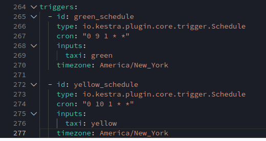

## Question 1
I disabled the the purge_files task so that the file is not deleted after loading into postgresql database. 

This was achieved by adding the following property in the purge_files task:
```
disabled: true
````

## Question 2
According to the question, the rendered value of the variable file is made up of the following:
```
{{inputs.taxi}} = green
 _tripdata_ is a constant value
{{inputs.year}} = 2020
- is a constant value
{{inputs.month}} = 04
.csv is a constant value
```

Answer: green_tripdata_2020-04.csv


## Question 3
Executed the flow in [here](./flows/02_postgres_taxi_scheduled.yaml) for Yellow taxi and configuring the backfill extensions in the Trigger tab.

This is shown in the image below


## Question 4
Executed the flow in [here](./flows/02_postgres_taxi_scheduled.yaml) for Yellow taxi and configuring the backfill extensions in the Trigger tab.

This is shown in the image below


## Question 5
Modified the flow that listed just years 2019 and 2020 to include 2021. The modified file can be found  [here](./flows/02_postgres_taxi_all_years.yaml).

Executed the flow selecting Green taxi, year 2021 and month 03. This is shown in the image below.


## Question 6
Timezone configuration to New York was achieved by adding a timezone property set to America/New_York in the Schedule trigger configuration.

This is shown in the image below


