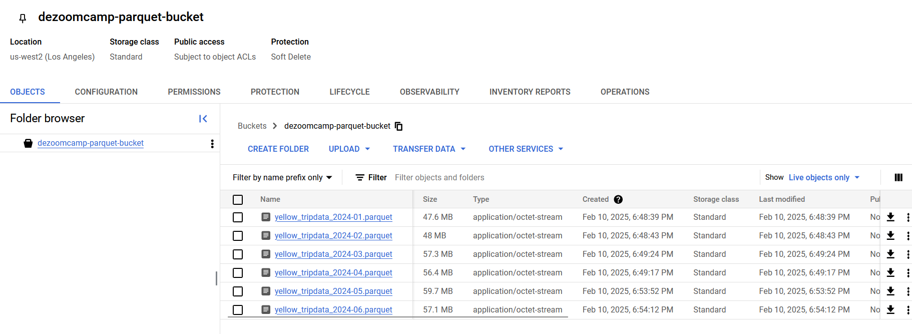
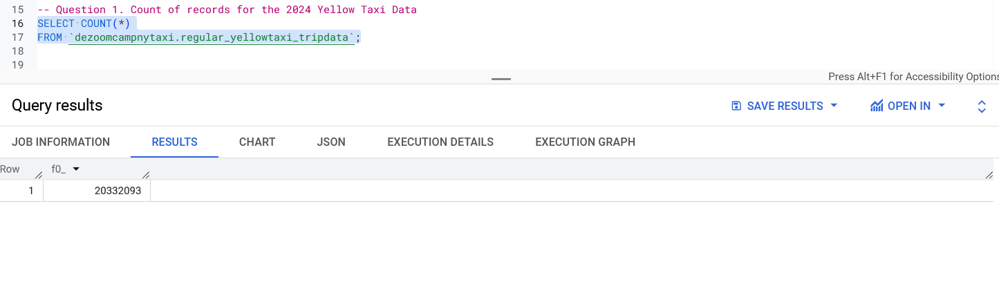
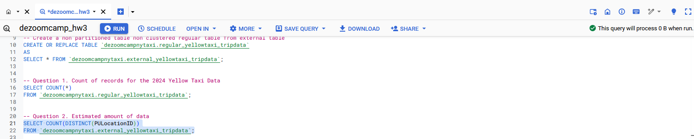
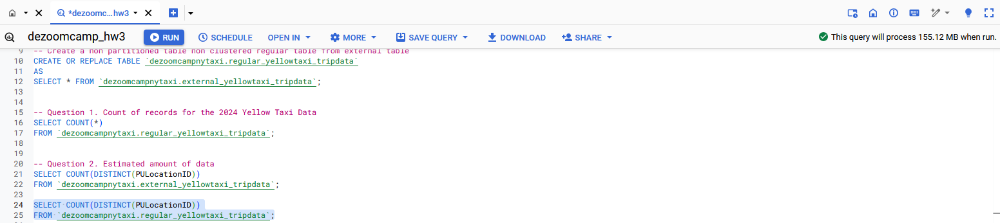
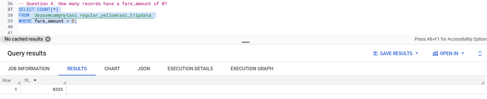
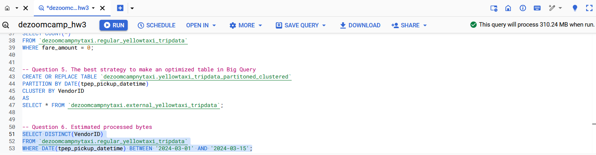
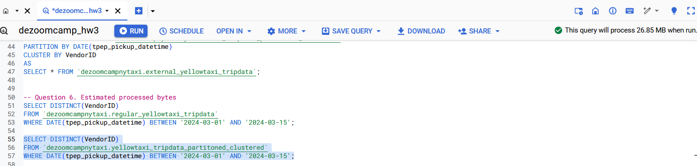
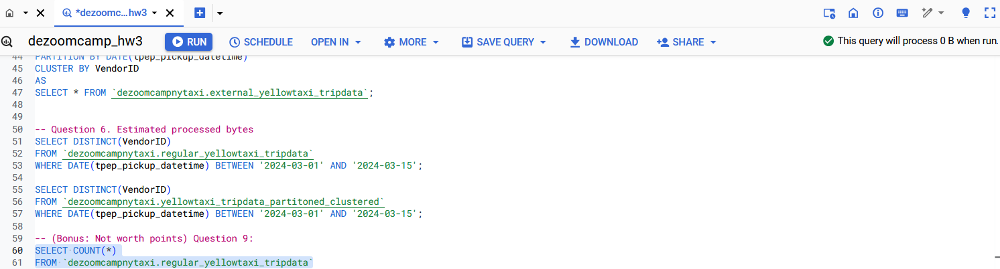

The download of the parquet files and upload to my GCS bucket was carried out using the linked script [here](./load_yellow_taxi_data.py):<br>
The screenshot of the downloaded files is below:<br/>


BIG QUERY SETUP queries</br>
Create an external table using the Yellow Taxi Trip Records. </br>
```
CREATE OR REPLACE EXTERNAL TABLE `dezoomcamp2025-449018.dezoomcampnytaxi.external_yellowtaxi_tripdata`
OPTIONS (
  format = 'CSV',
  uris = ['gs://dezoomcamp-kestra-bucket/yellow_tripdata_2019-*.csv', 'gs://dezoomcamp-kestra-bucket/yellow_tripdata_2020-*.csv']
);
```
Create a (regular/materialized) table in BQ using the Yellow Taxi Trip Records (do not partition or cluster this table). </br>
```
CREATE OR REPLACE TABLE `dezoomcamp2025-449018.dezoomcampnytaxi.regular_yellowtaxi_tripdata` 
AS
SELECT * FROM `dezoomcampnytaxi.external_yellowtaxi_tripdata`;
```


## Question 1
SQL query for the count of records for the 2024 Yellow Taxi Data is below:
```
SELECT COUNT(*)
FROM `dezoomcampnytaxi.regular_yellowtaxi_tripdata`;
```
The result can be seen in the screenshot below:<br/>


Answer: **20332093**

## Question 2
SQL query to count the distinct number of PULocationIDs for the entire dataset on both the tables.</br>
```
SELECT COUNT(DISTINCT(PULocationID))
FROM `dezoomcamp2025-449018.dezoomcampnytaxi.external_yellowtaxi_tripdata`;

SELECT COUNT(DISTINCT(PULocationID))
FROM `dezoomcamp2025-449018.dezoomcampnytaxi.regular_yellowtaxi_tripdata`;
```

The estimated amounts are shown in the screenshots below:<br/>




Answer: **0 MB for the External Table and 155.12 MB for the Materialized Table**


## Question 3
SQL query to retrieve the PULocationID from the table (not the external table) in BigQuery:<br/>
```
SELECT PULocationID
FROM `dezoomcamp2025-449018.dezoomcampnytaxi.regular_yellowtaxi_tripdata`;
```
SQL query to retrieve the PULocationID and DOLocationID on the same table:<br/>
```
SELECT PULocationID, DOLocationID
FROM `dezoomcamp2025-449018.dezoomcampnytaxi.regular_yellowtaxi_tripdata`;
```
Answer: **BigQuery is a columnar database, and it only scans the specific columns requested in the query. Querying two columns (PULocationID, DOLocationID) requires 
reading more data than querying one column (PULocationID), leading to a higher estimated number of bytes processed.**


## Question 4
SQL query to count the number of records having a fare_amount of 0:
```
SELECT COUNT(*)
FROM `dezoomcamp2025-449018.dezoomcampnytaxi.regular_yellowtaxi_tripdata`
WHERE fare_amount = 0;
```
The result can be seen in the screenshot below:<br/>


Answer: **8333**

## Question 5
SQL query to create new table with the best strategy to make an optimized table in Big Query if your query will always filter based on tpep_dropoff_datetime and order the results by VendorID:<br/>
```
CREATE OR REPLACE TABLE `dezoomcamp2025-449018.dezoomcampnytaxi.yellowtaxi_tripdata_partitoned_clustered`
PARTITION BY DATE(tpep_pickup_datetime)
CLUSTER BY VendorID 
AS
SELECT * FROM `dezoomcamp2025-449018.dezoomcampnytaxi.external_yellowtaxi_tripdata`;
```
Answer: **Partition by tpep_dropoff_datetime and Cluster on VendorID**


## Question 6
SQL query to retrieve the distinct VendorIDs between tpep_dropoff_datetime 2024-03-01 and 2024-03-15 (inclusive):</br>
**Using the materialized table**<br/>
```
SELECT DISTINCT(VendorID)
FROM `dezoomcamp2025-449018.dezoomcampnytaxi.regular_yellowtaxi_tripdata`
WHERE DATE(tpep_pickup_datetime) BETWEEN '2024-03-01' AND '2024-03-15';
```
**Using the partitioned table**<br/>
```
SELECT DISTINCT(VendorID)
FROM `dezoomcamp2025-449018.dezoomcampnytaxi.yellowtaxi_tripdata_partitoned_clustered`
WHERE DATE(tpep_pickup_datetime) BETWEEN '2024-03-01' AND '2024-03-15';
```
The estimated amounts are shown in the screenshots below:<br/>




Answer:**310.24 MB for non-partitioned table and 26.84 MB for the partitioned table**

## (Bonus: Not worth points) Question 9:
SQL query to count all records in materialized table:
```
SELECT COUNT(*)
FROM `dezoomcamp2025-449018.dezoomcampnytaxi.regular_yellowtaxi_tripdata`
```
The estimated amount is shown in the screenshot below:<br/>

Answer:**0B**

